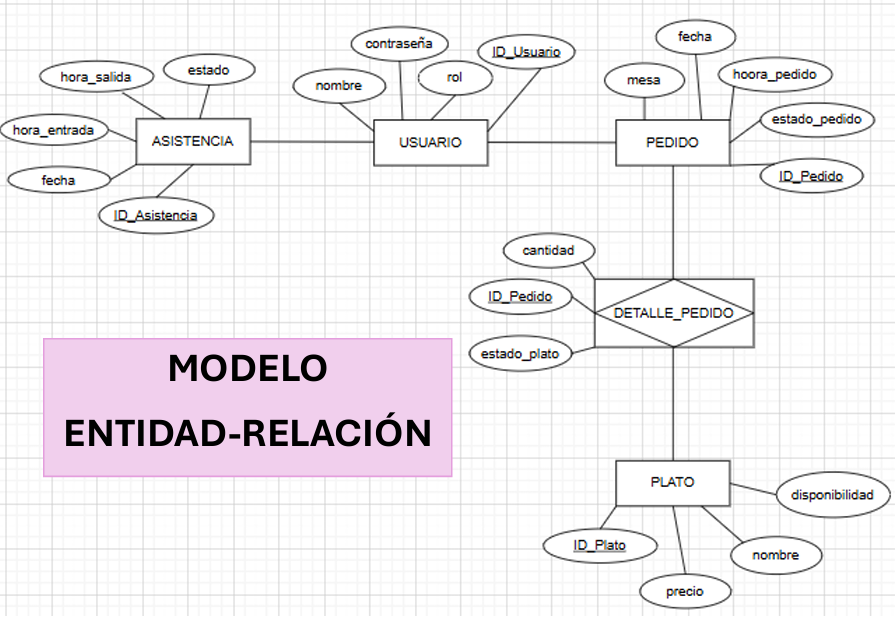

# SISTEMA WEB DE GESTIÓN PARA UN RESTAURANTE
## DESCRIPCIÓN DEL NEGOCIO
#### NOMBRE: 
RESTAURTANTE "  "Milagros"
#### CONTEXTO:
La empresa se dedica al rubro gastronómico, 
específicamente a la preparación y venta de 
alimentos y bebidas en un restaurante pequeño. 
Su actividad principal consiste en ofrecer distintos 
platos a los clientes, los cuales son solicitados a 
través de los mozos y preparados por el personal 
de cocina para su posterior servicio en las mesas 
del establecimiento. 
El restaurante cuenta con personal como mozos y 
trabajadores de cocina, quienes se encargan de 
tomar los pedidos, preparar los alimentos y atender 
a los clientes dentro del local.
## IDENTIFICAR EL PROBLEMA Y SOLUCIÓN
### PROBLEMA
El restaurante presenta problemas de organización 
en la gestión de pedidos, control del personal y 
registro de ventas. Actualmente los pedidos son 
realizados mediante WHATSAPP, pero igual se 
genera mucha confusión entre los mozos y la 
cocina, no existe un control claro de asistencia del 
personal y el cajero no cuenta con un registro 
organizado de las ganancias diarias. 
Además, cuando un plato se termina, no existe un 
sistema que lo elimine automáticamente de la lista 
de pedidos, lo que puede generar errores al 
momento de tomar las órdenes. 

### SOLUCIÓN
Desarrollar un sistema digital que 
permita gestionar los pedidos del 
restaurante, controlar la asistencia del 
personal, organizar la preparación de 
los platos en cocina y llevar un 
registro claro de las ventas y 
ganancias del negocio. 

## REQUERIMIENTOS FUNCIONALES

| USUARIO | ASISTENCIA | PEDIDOS | COCINA | MENÚ |
| ------------- | ------------- | ------------- | ------------- | ------------- |
| El sistema debe permitir registrar nuevos usuarios | El sistema debe registrar la hora de entrada del personal | El sistema debe permitir a los mozos registrar pedidos para las mesas | El sistema debe mostrar a cocina los pedidos enviados por los mozos | El sistema debe mostrar la lista de platos disponibles |
| El sistema debe permitir iniciar sesión con usuario y contraseña | El sistema debe registrar la hora de salida del personal  | El sistema debe registrar automáticamente la hora en que se realizó el pedido | El sistema debe permitir cambiar el estado del plato a “servido” | El sistema debe  permitir agregar nuevos platos |
| El sistema debe permitir editar los datos de los usuarios | El sistema debe determinar si el empleado llegó puntual o tarde | El sistema debe mostrar la lista de pedidos registrados | El sistema debe mostrar los pedidos ordenados según la hora en que se realizaron | El sistema debe permitir editar la información de los platos |
| El sistema debe permitir eliminar usuarios del sistema | El sistema debe mostrar el historial de asistencia por empleado | El sistema debe mostrar el estado del pedido (pendiente, en preparación, servido, entregado) | El sistema debe indicar cuando un pedido está listo para entregar | El sistema debe permitir eliminar platos cuando ya no estén disponibles |
| El sistema debe permitir cerrar sesión de forma segura |  | El sistema debe permitir que el mozo marque el pedido como entregado |  | El sistema debe indicar cuando un plato no está disponible |

## REQUERIMIENTOS NO FUNCIONALES
| SEGURIDAD | RENDIMIENTO | USABILIDAD | MANTENIBILIDAD |
| ------------- | ------------- | ------------- | ------------- |
| Las contraseñas deben almacenarse cifradas en la base de datos | El sistema debe responder en menos de 3 segundos | La interfaz debe ser sencilla e intuitiva para los empleados | El sistema debe estar desarrollado bajo arquitectura MVC |
| El sistema debe restringir el acceso según el rol (administrador, mozo, cocina) | El sistema debe permitir varios usuarios conectados al mismo tiempo | El sistema debe ser accesible desde cualquier navegador web | La base de datos debe estar normalizada |
| El sistema debe cerrar sesión automáticamente por inactividad | Los pedidos deben actualizarse en tiempo real | El sistema debe mostrar mensajes claros cuando ocurra un error | El sistema debe permitir futuras mejoras o actualizaciones |

## STACK COMPLETO
1. Trello = Gestión del proyecto (Kanban)
2. Draw.io = Diagrama ER + Diagrama de Clases
3. Figma = Wireframe + Diseño UI/UX
4. MySQL Workbench = Diseñar y administrar BD
5. IntelliJ = Frontend (HTML,CSS,JS) + Backend (Spring Boot)
6. XAMPP = Servidor Tomcat para correr la app

## TECNOLOGIAS UTILIZADAS
- Java 17
- Spring Boot 3
- MySQL 8
- HTML5, CSS3, JavaScript
- IntelliJ IDEA
- XAMPP (Tomcat)
- MySQL Workbench
- Figma (diseño UI/UX)
- Draw.io (diagramas)
  
## ESTRUCTURA
Proyecto-Restaurante/

├── backend/          → Spring Boot (Java)

│   ├── src/

│   ├── pom.xml

│   └── ...

├── frontend/         → HTML, CSS, JS

│   ├── css/

│   ├── js/

│   └── index.html

## BASE DE DATOS 
El sistema cuenta con 5 tablas principales:

| TABLA | DESCRIPCIÓN |
| ------------- | ------------- |
| Usuario | Representa a las personas que utilizan el sistema, como administrador, mozo o personal de cocina. Permite identificar quién realiza acciones dentro del sistema. |
| Asistencia | Registra la asistencia del personal, incluyendo la hora de entrada, salida y el estado (asistió, tarde o falta). |
| Pedidos | Contiene la información de los pedidos realizados por los mozos, como la mesa, la hora y el estado del pedido. |
| Cocina | Muestra los pedidos enviados por los mozos para su preparación. Permite actualizar el estado de los platos (pendiente, en preparación, servido). |
| Menú | Administra los platos disponibles del restaurante, permitiendo agregar, editar o eliminar platos, así como indicar su disponibilidad. |

### DIAGRAMA ENTIDAD RELACIÓN (DER)

### DIAGRAMA RELACIONAL (MR)

## CARDINALIDADES
### USUARIO -- ASISTENCIA (1:N)
Un usuario puede tener muchas asistencias, y una asistencia pertenece a un solo usuario.
### USUARIO -- PEDIDO (1:N)
Un mozo puede registprar muchos pedidos y un pedido lo hace un solo usuario.
### PEDIDO -- PLATO (N:M)
Muchos pedidos puedes pertecen a varios platos, tanto como muchos platos pueden estar en muchos pedidos.

## ESTO SE RESUELVE CON: 'DETALLE PEDIDO'
- Al tener la relación muchos a muchos (N:M), se crea una entidad asociativa o tambien conocida como entidad intermedia.
  
### PEDIDO -- DETALLE PEDIDO (1:N)
Un pedido puede tener varios platos, pero cada detalle pertenece a un pedido.
### PLATO -- DETALLE_PEDIDO (1:N)
Un plato puede estar en muchos pedidos, pero cada detalle tiene un solo plato

